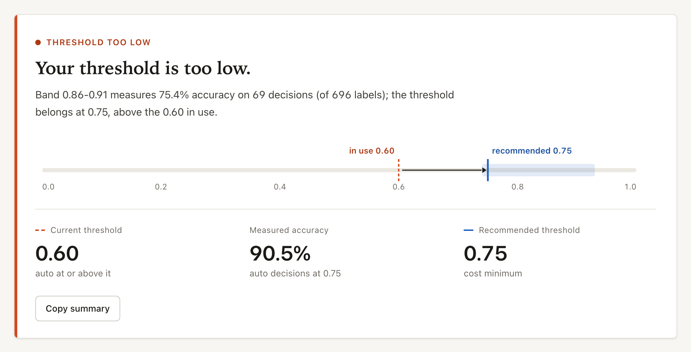
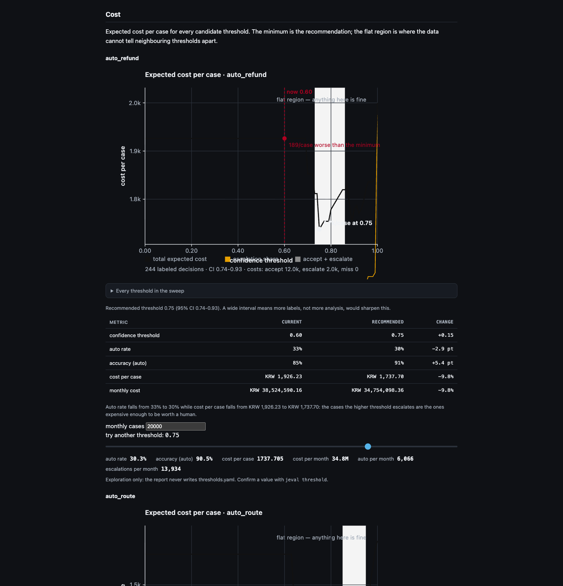

# jeval

**jeval measures what your Jev classifier's confidence is really worth, and sets the human
hand-off line from what a mistake costs.**

Your classifier answers with a label and a confidence. jeval answers the two questions that
follow: *when it says 0.9, how often is it actually right?* and *given what a mistake costs,
where should the line sit?*

## Hand it to an agent

Nobody wants a command tour. Give an agent one sentence and take the artifact back:

> Install jeval (`uvx --from git+https://github.com/rlaope/jeval jeval --help`), find where my
> classifier's decisions are logged, describe that shape in `.jeval/ingest-map.yaml`, run
> `jeval report`, and show me the report file.

What it should produce, and in what order:

| Artifact | What it answers |
| --- | --- |
| `report.html` — one self-contained file | Are the confidences trustworthy, where do they break, and what does the threshold in use cost? |
| `thresholds.yaml` — read by your application | The threshold to deploy, with a bootstrap interval, and whether splitting by segment pays |
| `labels.csv` — a sheet to fill in | Which decisions, labeled next, buy the most certainty |
| `calibration-*.yaml` — optional | A correction map your application applies, exported only when the gain is real |

[`llms.txt`](llms.txt) is the machine-readable entry point, and
[`docs/agent-setup.md`](docs/agent-setup.md) is the playbook the agent follows — including what to
do when nothing is logged yet and when there are no labels, which is where most attempts stall.

## What it looks like

<p align="center">
  
  
</p>

Left: the verdict and the reliability curve, with Wilson intervals on every bin. Right: the cost
curve, the impact table, and the slider that recomputes it. Both are screenshots of the report
committed to this repository — open
[`examples/report-example.html`](examples/report-example.html) in a browser (one 249 KB file, no
network, no server), or rebuild it byte-for-byte with:

```sh
uv run jeval demo --out-dir examples/report-example --seed 11 --scale 0.5
cp examples/report-example/report.html examples/report-example.html
```

Synthetic data and synthetic costs, seeded, so the example is reproducible rather than a
one-off screenshot anyone could have made up.

It is **provider-neutral by design**. Anything that returns a probability works — a vendor API,
a local model, a logistic regression, a rules engine with a score. jeval does not verify any
vendor's calibration claim and is not tied to one: the name came from one model family, the
tool sits above all of them.

---

## Get it

```sh
curl -fsSL https://raw.githubusercontent.com/rlaope/jeval/main/install.sh | sh
jeval demo
```

That is the whole installation: a `jeval` command on your PATH. No uv, no pipx, no root, and nothing
to do with PyPI. The installer puts a private virtual environment under `~/.local/share/jeval`, links
`jeval` into `~/.local/bin`, and prints the one line to add if that directory is not on your PATH yet
— or pass `--modify-path` and it edits your shell rc for you. Re-run it to upgrade;
`sh install.sh uninstall` removes everything it made.

Prefer to install nothing at all?

```sh
uvx --from git+https://github.com/rlaope/jeval jeval demo
pip install https://github.com/rlaope/jeval/releases/download/v0.1.7/jeval_cli-0.1.7-py3-none-any.whl
```

It generates a synthetic decision log whose miscalibration is known, reports on it, and writes a
`report.html` you can open — the same artifact the rest of this page is about. Nothing is
downloaded from your side, no data leaves the machine, and the demo data is explicitly labeled
synthetic.

`pip install jeval` installs an **unrelated project**: that name on PyPI belongs to someone else,
and this tool is not published to PyPI at all. The two commands above are the install paths, and a
pinned wheel never changes under you.

## What the number actually means

A confidence is a claim. Here is the curve's own table, five of its ten rows copied out of the
report in [`examples/report-example.html`](examples/report-example.html) — a real generated
report, over synthetic data, committed so you can check every claim in this README against the
artifact itself:

```
Confidence bin      n   Stated   Observed   Wilson 95%      Gap
0.60-0.69          26     65%       46%     [29%, 65%]   -0.188
0.74-0.77          26     76%       69%     [50%, 83%]   -0.064
0.82-0.85          26     83%       69%     [50%, 83%]   -0.140
0.91-0.95          25     93%       96%     [80%, 99%]   +0.033
0.97-1.00          26     98%      100%     [87%, 100%]  +0.016
```

Read the third row: the model said 83% and was right 69% of the time, and the interval around
that number spans 50% to 83% — which is what a 26-record bin can actually support.

That report's own verdict, for the threshold the demo treats as deployed:

> **Your threshold is too low.** Band 0.03-0.44 measures 68.6% accuracy on 70 decisions (of 696 labels); the threshold belongs at 0.75, above the 0.60 in use.

| | now | recommended | change |
| --- | --- | --- | --- |
| confidence threshold | 0.60 | 0.75 | +0.15 |
| auto rate | 33% | 30% | -2.9 pt |
| accuracy (auto) | 85% | 91% | +5.4 pt |
| cost per case | KRW 1,926.23 | KRW 1,737.70 | -9.8% |
| monthly cost | KRW 38,524,590.16 | KRW 34,754,098.36 | -9.8% |

No screenshot, because a table is easier to check — and no invented numbers, because the artifact
is right there in the repository.

## You could write this yourself with 30 lines of pandas

Yes. You should, once. Here is the whole idea:

```python
import pandas as pd

df = pd.read_json("decisions.jsonl", lines=True)
df = df[df.label.notna()].copy()  # only labeled decisions count
df["correct"] = df.prediction == df.label
df["bin"] = pd.cut(df.confidence, [0, 0.1, 0.2, 0.3, 0.4, 0.5, 0.6, 0.7, 0.8, 0.9, 1.0])

table = df.groupby("bin", observed=True).agg(
    n=("correct", "size"),
    claimed=("confidence", "mean"),
    actual=("correct", "mean"),
)
table["gap"] = table.actual - table.claimed
ece = (table.n / table.n.sum()).dot(table.gap.abs())

print(table)
print(f"ECE = {ece:.3f}")
```

That is the measurement, and it is correct. Run it on the same records as `jeval report` and the
number will still disagree, because of one line: `pd.cut` bins by equal width while jeval bins by
quantile. On the 91 labeled records in `examples/`, that single choice is the difference between
ECE 0.113 and ECE 0.076 — equal-width binning put 38 of those labels in one bin while the others
held 17 and 18, so one bin carried 40% of the weight.

Which number you ship is a real decision, not a detail. jeval is what you need *after* you have
written the 30 lines once and realised the hard part is everything around them.

## The hard part is that this is a standing problem, not an analysis

- It has to run **every week, per question, per segment** — not once on a laptop.
- **Sampling error is the whole ballgame.** Nobody hand-rolls Wilson or bootstrap intervals,
  so people read a 12-record bin as if it were the truth and move a production threshold on it.
- Notebooks live on **one person's machine**. When that person is on holiday, nobody can
  re-run the number, and the number still governs production.
- **The model changes under you.** A pinned tag or an auto-updating alias swaps the model
  behind a threshold you tuned last quarter, and you find out three weeks later.

jeval turns all four into one command with an exit code.

## `jeval drift` is the part a notebook cannot replace

A notebook measures once. Drift detection is what happens when the thing you measured changes:

```
$ jeval drift --root /tmp/jeval-drift --fail-on ece-increase=0.05
costs: /tmp/jeval-drift/costs.yaml
model changed: jev-1.13.0 -> jev-1.14.0 (Sep 16)
  question    ECE before  ECE after   delta
  department       0.028      0.141  +0.113   FAIL
recommended threshold (department): 0.96 -> 0.98
  at the current 0.96: auto-rate 2% -> 5%
$ echo $?
1
```

That is a captured run, not a mock-up, and you can rebuild the log it ran on — 1,800 synthetic
decisions where the newer model version is deliberately overconfident:

```sh
uv run python examples/make-drift-log.py /tmp/jeval-drift
uv run jeval drift --root /tmp/jeval-drift --fail-on ece-increase=0.05
``` The threshold line only appears when a cost matrix is present — with
no costs, the block says `recommended threshold: not available (no cost matrix was applied)` rather
than inventing a number. Wire the same command into CI and a model swap cannot silently
degrade a production decision boundary. There is a copy-paste starting point in
[`examples/ci/drift.yml`](examples/ci/drift.yml): it runs `drift --fail-on`, prints the markdown
summary, and comments it on the pull request. jeval prints that summary; the workflow posts it,
because jeval never holds a token.

`--baseline .jeval/baseline.json` compares against the last measurement you accepted rather than
only model-to-model, which matters when the model string never changes but the behaviour does. The
snapshot holds measurements, never records, so it is safe to commit.

## Pointing it at your own system

Install once, wrap the client you already use, and every call is recorded where it was made:

```python
from typesafe_sdk import TypeSafeClient  # your SDK, not jeval's
from jeval import collect

client = collect.track(
    TypeSafeClient(),
    method_names=("system_one",),                      # the method that answers questions
    source_key=lambda **kw: kw["trace_id"],            # what a human answer is joined back on
    segment=lambda **kw: {"lang": kw.get("lang")},     # so --by lang works on your traffic
)
```

Then put the file where the report reads it — `JEVAL_ROOT=/var/lib/jeval` writes
`/var/lib/jeval/.jeval/records.jsonl`, the same file `jeval report --root /var/lib/jeval` opens —
and check `collect.stats()["calls"]` is not zero after your first request: a wrapper that found no
method to patch is counted in `no_method_found`, because a silent no-op is how an integration looks
installed while collecting nothing.

That is the whole integration. The wrapper makes no calls of its own: it observes the call you
already make, records the answers, and returns exactly what the client returned. It cannot take
your service down — a failed write is counted, never raised, and collection is off with
`JEVAL_COLLECT=0` or pointed elsewhere with `JEVAL_COLLECT=/var/log/decisions.jsonl`.

Then measure:

```sh
$ jeval report
```

Three things come out of that wrapper, and the third is the one that matters most: the answers with
their probabilities, the **model that actually answered** (`jev-1.13.0`, never the `jev-latest`
you asked for), and the **join key**. Without the join key there is no free-label harvest, because
nothing else in your stack knows which decision a human answer belongs to.

### A log you already have

If you already write these responses somewhere, skip the wrapper and ingest the file directly:

```sh
$ jeval ingest --preset jev-native api-decisions.jsonl
preset: jev-native (response at 'response', answers under 'answers', join key from 'request_id')
read 4 rows
wrote 8 records to .jeval/records.jsonl
```

The preset reads the response object as the API returned it — `answers` keyed by question name,
`choice`/`noul`/`score`, probabilities, confidence, `usage.input_tokens`. No reshaping, no column
mapping. `jeval ingest --list-presets` shows what is available; `--response-field` and
`--source-key-field` override where it looks.

## What jeval does not do

- It does **not** validate a vendor's calibration claim in general. It measures the model you
  actually ran, on the records you actually supplied.
- Threshold recommendations depend **entirely on the cost numbers you type in**. If your costs
  are wrong, the recommended threshold is wrong, and nothing in the output will warn you.
- Results built from **silver labels** (labeled by another model) are an *agreement rate*, not
  an accuracy, and the report says so loudly.
- **Without labels, jeval measures nothing.** Read "Getting labels for free" below before
  concluding the tool is unusable — you are probably already producing labels without
  noticing.
- The report marks the threshold **in use** only when your project says what that is: pass
  `--current`, or keep a `thresholds.yaml`. With nothing deployed it says so instead of comparing
  the recommendation with itself.
- `--bins 1` is refused. One bin averages every decision together, so ECE collapses toward zero and
  the report reads as "confidence is trustworthy" whatever the data says.
- A label with no `label_source` counts as **silver**, never as gold: a label whose provenance is
  unknown is not evidence of accuracy.
- `jeval calibrate` exports a correction map; **jeval never applies it**. Adapters, gateways,
  routers and request-path libraries stay out of scope — that is your application's job.
- The collector is a **recorder, not a proxy**. It never calls a model, never chooses one, never
  retries, never blocks and never routes; it observes a call your code already makes and appends a
  line. It imports no vendor SDK — the wrap works on any object with a method that takes questions
  and returns typed answers — and a preset, not a branch, is where a product's field names live.
- No gateway, no router, no hosting, no prompt optimization, no fine-tuning, no dashboard,
  no accounts.

## Getting labels for free

The single biggest reason people bounce off calibration tooling is that they think they need a
labeling project. You usually do not. You are already producing labels:

| You already have | Where the label is |
| --- | --- |
| Cases a human reviewed after escalation | the human's final answer — that is ground truth for the model's answer |
| Auto-processed cases that were later reversed | the reversal — the model was wrong |
| Refund approvals and rejections | the outcome — a real, dated answer |

Point `.jeval/ingest-map.yaml` at those fields and labeling cost drops to a mapping exercise:

```yaml
label_from:
  field: resolution.final_department   # dotted paths work
  source: human_override               # human_review | human_override | silver
  join_on: ticket_id                   # the key shared by your log and the resolution log
  question: department                 # the question this column answers
```

```sh
$ jeval ingest log.jsonl                       # records carry source_key from `join_on`
$ jeval ingest log.jsonl --labels resolutions.jsonl
applied 412 labels to 1,240 records to the 'department' question
left 828 record(s) of other questions alone: 'resolution.final_department' answers one question,
  and a request's other questions share the same key
```

`question:` is not decoration. A join key is shared by every question of a request, so without it a
department answer would also be written as the *intent* answer. Two guards stand between your
records and a wrong label: a harvest never overwrites an existing label unless you pass
`--overwrite`, and it refuses a label the record's own question could not have produced (a
`choice` label outside that record's `probabilities`, a `noul` answer that is not yes/no) instead
of writing it — refusing is counted and named in the output, because a wrong label is worse than a
missing one. Pass `--allow-unlisted-labels` if your `probabilities` map lists top candidates only.

The same guard applies to labels that arrive inside the log itself: a label the record's own
question cannot produce is dropped, named, and counted at ingest, because an impossible label is
recorded as a wrong answer forever while looking like ground truth.

The harvest rewrites `.jeval/records.jsonl` in place and atomically, touching only the label
fields — every other byte of your log is preserved.

## How many more labels do you need?

The interval around your ECE is the honest limit of what your sample can say. `jeval plan` projects
how many additional labels each question needs to tighten it — and refuses to guess below 200
labels:

```
$ jeval plan --target-ci 0.05
scope      key                       n     ECE      CI  needed
question   department              511   0.062   0.059  0.015: 6,346 · 0.030: 1,204 · 0.050: 91
question   intent                  490   0.124   0.064  0.016: 6,967 · 0.032: 1,375 · 0.050: 276
question   satisfaction              0     nan     nan  only 0 gold-labeled records; at least 200
  are needed before the k/sqrt(n) scaling can be fitted
```

The projection assumes the interval width scales as `k/sqrt(n)` with `k` fitted from your own data
at `n` and `n/2`. It is an estimate, and the output says so.

## If you want to fix the confidence, not just measure it

`jeval calibrate` fits a correction — temperature scaling or isotonic regression — and exports it
as a YAML map your application applies:

```
$ jeval calibrate --method both
temperature: ECE 0.144 -> 0.061 (cross-validated, n=1,240)
  wrote /your/project/.jeval/calibration-temperature.yaml
isotonic: ECE 0.144 -> 0.072 (cross-validated, n=1,240)
  wrote /your/project/.jeval/calibration-isotonic.yaml
```

Two things keep this honest. The gain is measured **cross-validated**, never on the records the map
was fitted on, and a map ships only if that gain beats the sampling noise of your own log. When it
does not, `calibrate` exports nothing and says so:

```
$ jeval calibrate --method isotonic
isotonic: ECE 0.041 -> 0.041 (cross-validated, n=1,240)
  No correction retained: the best map moves cross-validated ECE by +0.003, which does not clear
  the 0.022 floor. Apply() is the identity here: this log does not need this correction.
  no correction exported: shipping an unearned map would make it worse
```

jeval never applies the map. It writes a file; your application reads it. There is no request path
where jeval sits between you and your model.

## Segments: does one threshold fit everyone?

The report already shows that your segments are not calibrated alike. `jeval threshold --by lang`
asks the follow-up question in money: does giving a segment its own threshold pay?

```
$ jeval threshold --by lang
auto_route by lang: global threshold 0.84
  segment            threshold  cost/case  vs global      n  verdict
  lang = en               0.81   1,306.30     -42.52    254  split
  lang = ko               0.84   1,159.92       0.00    257  splitting does not pay: its optimum 0.84
    is within one sweep step (0.01) of the global 0.84 and the cost change of 0 per case is
    under the 2% bar.
auto_escalate_urgent by lang: global threshold 0.87
  segment            threshold  cost/case  vs global      n  verdict
  lang = en               0.70     740.74    -119.05    189  split
  lang = ko               0.89     912.09       0.00    182  splitting does not pay: its optimum 0.89
    differs from the global 0.87 and the cost change of 0 per case is under the 2% bar.
```

That is the demo dataset with the demo cost matrix. A split is recommended only when the segment's
optimum moves by more than one sweep step **and** adopting it changes cost per case by more than
2%; otherwise the output says "splitting does not pay" and names the clause that failed. Note the
answer is not uniform — `en` pays to split on both actions, `ko` never does. A one-line answer to a
question people usually settle by intuition.

## Status

v0.1 is milestones M0–M4 plus the report extension (R0–R4). Anything not listed as implemented
below is not implemented; the repository does not ship stubs that look finished. `tests/test_documented_features.py`
fails if this table and the command surface disagree in either direction.

| Command | Purpose | Status |
| --- | --- | --- |
| `jeval init` | scaffold `.jeval/` config and ingest map | implemented (M0) |
| `jeval ingest` | JSONL/CSV logs to decision records; `--preset jev-native` reads a decision API's own response log; `--labels` harvests human answers | implemented (M0, M3) |
| `jeval report` | the argument document: verdict, reliability, cost, impact, segments, score questions, labels-and-correction, drift, data quality — one HTML file, or `--format md` for a paste-ready summary | implemented |
| `jeval demo` | synthetic log with known miscalibration, rendered through the same report path | implemented |
| `jeval threshold` | cost matrix to per-action threshold with a bootstrap interval, written to `thresholds.yaml`; `--by <segment>` answers whether splitting pays | implemented |
| `jeval drift` | model-version and period comparison, baseline snapshots, `--fail-on` exit codes, and the cost-driven threshold movement per slice when a cost matrix is present | implemented |
| `jeval ingest --labels` | free-label harvest: human answers from a resolution log, joined on your own key (M3) | implemented |
| `jeval label` | active-learning labeling queue with a CSV sheet to fill in (M4) | implemented |
| `jeval plan` | additional labels needed for a tighter interval, per question and segment | implemented |
| `jeval calibrate` | temperature / isotonic correction map, cross-validated, exported as YAML for your app | implemented |

`jeval label` is a queue and a sheet, not a full-screen TUI: it ranks what to label, exports the
sheet, and applies your answers back with `jeval label --apply labels.csv`.

## The report is an argument, not a dashboard

A terminal summary cannot show the shape of a curve, and it cannot be pasted into a thread when
you are trying to move a threshold. So `jeval report` writes one self-contained HTML file that
reads top to bottom as a single case:

| Section | What it settles |
| --- | --- |
| ① Verdict | the conclusion in one sentence, with a Copy summary button for the thread |
| ② Reliability | the curve, with dot size by sample count, Wilson intervals, and a density strip showing where your traffic sits |
| ③ Cost | expected cost per case for every candidate threshold, with the minimum and the flat region marked |
| ④ Impact | what changes if you move: auto rate, accuracy of what stays automated, cost per case, monthly |
| ⑤ Segments | which slice is misfiring, worst first, small segments greyed rather than dropped |
| ⑥ Drift | before/after curves, model-change markers, and the threshold staircase (when there is something to compare) |
| ⑦ Data quality | labeled vs unlabeled, label sources, bin counts, and the limitations in plain words |

No chart library, no server, no external request of any kind: every chart is inline SVG built by
jeval, and the file opens offline. The threshold slider in ④ is exploration only — the report
never writes `thresholds.yaml`, because a browser should not be editing your configuration.

```sh
jeval report                          # report.html
jeval report -o out/week38.html       # somewhere specific
jeval report --by lang --by tier      # segment breakdown, two axes gives a grid
jeval report --question intent        # one question only
jeval report --compare .jeval/baseline.json   # activate ⑥ Drift
jeval report --format md              # verdict + impact as markdown, for a PR comment
jeval report --open                   # open it when it is done
```

`--format md` prints only the verdict and the impact table. That is deliberate: it is what a CI
job pastes into a pull request when `jeval drift` fails, so a reviewer learns what happened
without opening a file. jeval itself never posts it — that needs a token, and jeval does not
handle tokens.

`jeval threshold` writes the file your application reads:

```yaml
generated_at: 2026-09-20T11:00:00Z
model: jev-1.13.0
n_records: 1240
actions:
  auto_refund:
    threshold: 0.91
    expected_cost_per_case: 1830
    auto_rate: 0.62
    ci: {low: 0.87, high: 0.94}
```

Wide interval? That is a label problem, not an analysis problem, and the command says so.

## Install

```sh
uvx --from git+https://github.com/rlaope/jeval jeval demo            # nothing installed, current main
uvx --from git+https://github.com/rlaope/jeval@v0.1.7 jeval demo     # nothing installed, pinned
```

```sh
pip install https://github.com/rlaope/jeval/releases/download/v0.1.7/jeval_cli-0.1.7-py3-none-any.whl
```

`pip install jeval` installs an unrelated project: that name on PyPI belongs to someone else. This
tool is deliberately not on PyPI — releases are GitHub release assets instead, so the wheel URL
above is the pinned, installable artifact and `uvx` needs no installation at all. Every tag is built by the release workflow, which attaches the wheel and
the sdist to the GitHub release and reads the asset list back — nothing is uploaded by hand. From a checkout:

```sh
git clone https://github.com/rlaope/jeval && cd jeval
uv sync --all-groups
uv run jeval demo --out-dir /tmp/jeval-demo
```

Python 3.10 or newer. Runtime dependencies: `numpy`, `pydantic`, `pyyaml`, `typer`. The report
contains no JavaScript and no external assets — one HTML file you can email.

## Data model

Everything is a decision record, one question per record. Records live in `.jeval/records.jsonl`
so they diff, stream and survive whatever tool you read them with.

```jsonc
{
  "id": "rec_1f4c2a...",
  "ts": "2026-09-20T10:31:02Z",
  "model": "jev-1.13.0",          // the model string from the response; the drift anchor
  "question_key": "department",
  "question_type": "choice",     // choice | score | noul
  "prediction": "billing",
  "confidence": 0.91,            // normalized top-1 probability
  "probabilities": {"billing": 0.91, "technical": 0.06, "other": 0.03},
  "label": "billing",            // null until something labels it
  "label_source": "human_override",
  "segment": {"lang": "ko", "tier": "pro"},
  "state_tokens": 1840,
  "latency_ms": 210,
  "cost_usd": 0.00008
}
```

Three properties of this schema carry most of the value:

- **One record per question.** A single request that answers "is this a refund?" and "how
  annoyed is the customer?" can be reliable on one and useless on the other. Pooled metrics
  hide exactly that.
- **`model` is preserved verbatim.** `jev-latest` points at different models over time; a
  threshold tuned against it is a threshold tuned against something that no longer exists.
- **`state_tokens` is preserved.** Accuracy tends to fall as the state grows, so
  `--by state_tokens` is one of the more useful reports you can run.

`score` records are deliberately not folded into accuracy: a score is near or far, not right or
wrong, and the report says how many were excluded instead of pretending they were counted.

## Development

```sh
uv sync --all-groups
uv run pytest                 # includes the synthetic-data restoration tests
uv run ruff format --check .
uv run ruff check .
uv run mypy jeval
uv run jeval demo --out-dir /tmp/jeval-demo
```

The statistics are the product. `tests/test_synth.py` generates decision logs with a *known*
miscalibration and asserts that the measurement code recovers it — a calibrated sample must
report ECE near zero, an inflated one must report the inflation, and a 95%-accurate sample that
always claims 0.99 must be caught as overconfident. If a change to the statistics cannot pass
those tests, the change is wrong, not the tests.

See `CONTRIBUTING.md` for the commit convention and `CLAUDE.md` for the rules that apply to
automated contributors.

## License

Apache-2.0. See `LICENSE`.
