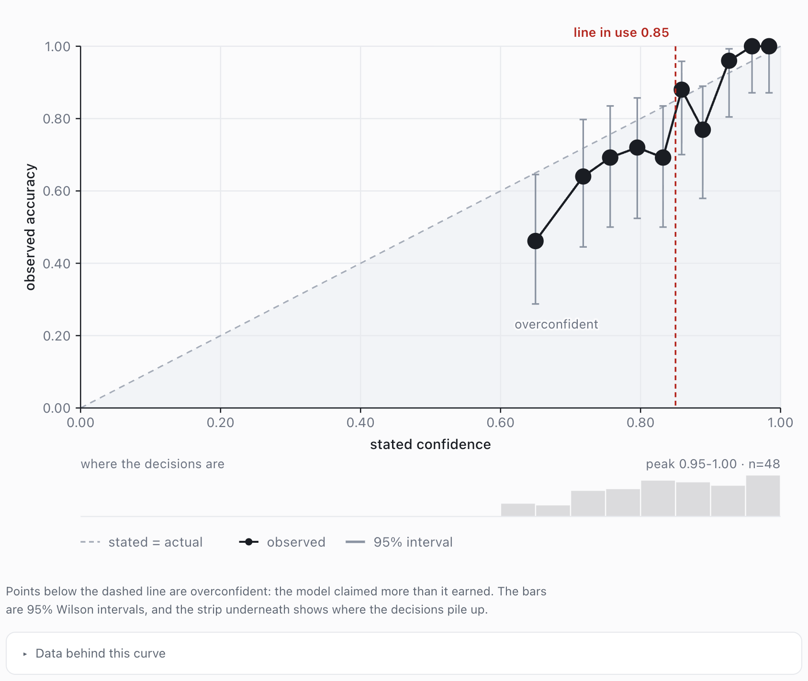
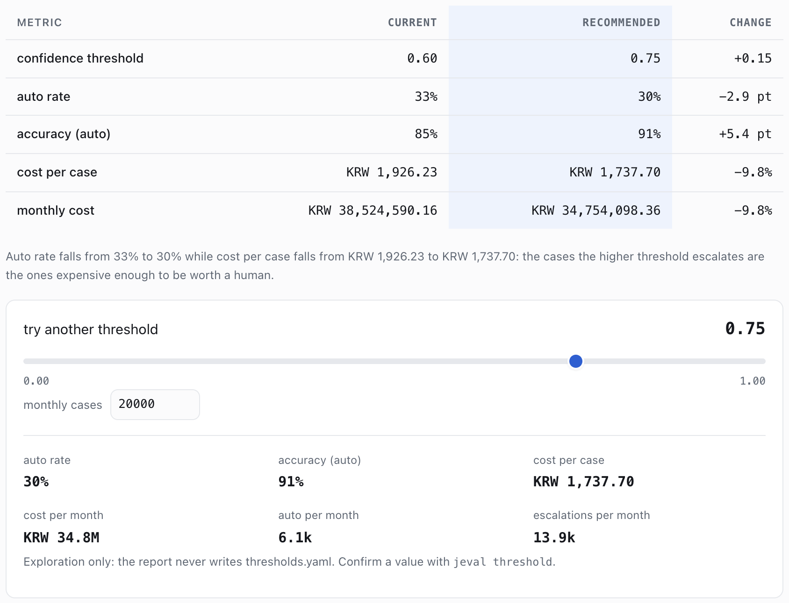
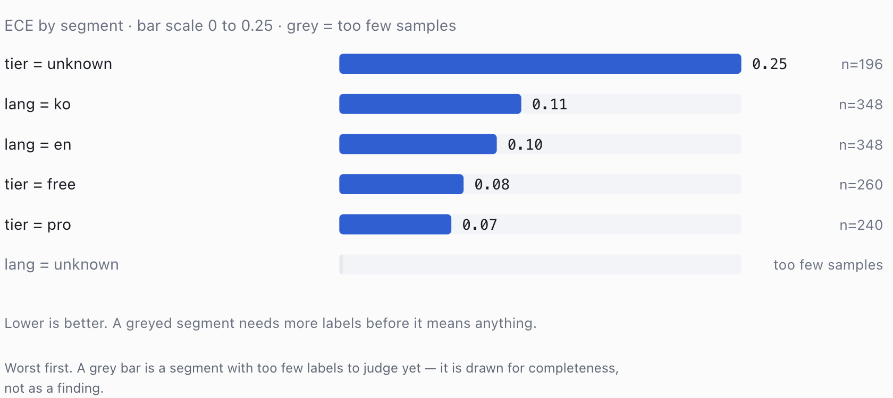

<p align="center">
  <picture>
    <source media="(prefers-color-scheme: dark)" srcset="docs/logo-dark.png" />
    
  </picture>
</p>

<p align="center">
  <strong>Find out what your classifier's confidence is really worth,<br>
  and where to hand off to a human, based on what a mistake costs.</strong>
</p>

<p align="center">
  <a href="https://github.com/rlaope/jeval/actions/workflows/ci.yml"></a>
  <a href="https://github.com/rlaope/jeval/releases"></a>
  
  
</p>

Your classifier answers with a label and a confidence. Two questions follow, and jeval answers both:

1. When it says 0.9, how often is it actually right?
2. Given what a mistake costs, where should the line sit between "the machine decides" and "a human
   decides"?

The answers come out as **one HTML file you can open offline** and **one YAML file your app reads**.
Everything is measured from labeled decision records on disk. There is no server, no database, no
network call, no account and no token.

jeval works with anything that returns a probability: a hosted API, a gateway, a local model, a
logistic regression, a scoring rule. The name comes from one model family, but the tool sits above
all of them.

---

## See it

These are crops of [`examples/report-example.html`](examples/report-example.html), a report committed
to this repository and generated by the command further down this page. Every number quoted in this
README can be checked against that file.


*The conclusion first, with the three figures it rests on: the line in use, what it measures, and
where the line belongs instead.*



*What the model claimed, against how often it was right. Points below the dashed diagonal are
overconfident, the bars are 95% intervals, and the strip underneath shows where the decisions land.*



*What moving the line changes, and what it costs — as a table you can quote, and a slider that
answers "what if" without writing anything to disk.*



*Where the miscalibration actually lives. A grey bar is a segment with too few labels to judge.*

---

## Install

```sh
curl -fsSL https://raw.githubusercontent.com/rlaope/jeval/main/install.sh | sh
```

That is the whole install: a `jeval` command on your PATH. It needs no uv, no pipx, no root and no
PyPI. The installer keeps a private environment in `~/.local/share/jeval`, links `jeval` into
`~/.local/bin`, and prints the one line to add if that folder is not on your PATH yet — or pass
`--modify-path` and it edits your shell file for you. Run it again to upgrade, and
`sh install.sh uninstall` removes everything it created.

Want to install nothing at all?

```sh
uvx --from git+https://github.com/rlaope/jeval jeval --version            # current main
uvx --from git+https://github.com/rlaope/jeval@v0.1.8 jeval --version     # pinned tag
pip install \
  https://github.com/rlaope/jeval/releases/download/v0.1.8/jeval_cli-0.1.8-py3-none-any.whl
```

**Careful with `pip install jeval`:** that name on PyPI belongs to an **unrelated project**, and this
tool is not on PyPI at all. Use one of the lines above. Every release tag is built by the release
workflow, which attaches the wheel and the source archive to the GitHub release and checks the file
list afterwards.

Python 3.10 or newer. It uses only `numpy`, `pydantic`, `pyyaml` and `typer`. From a checkout:
`uv sync --all-groups`.

### Quick start

```sh
curl -fsSL https://raw.githubusercontent.com/rlaope/jeval/main/install.sh | sh
jeval demo --out-dir /tmp/jeval-demo    # a synthetic log, through the real report path
# open the report.html path the command prints
```

That is the whole loop. Point `jeval ingest` at your own log instead of the demo when you are ready,
then `jeval report --root <your project>` to rebuild the same file from your records.

---

## Try it on data you already have

Nothing set up yet? The demo builds a synthetic log whose miscalibration is known on purpose, so
there is something real for the report to find:

```sh
uv run jeval demo --out-dir examples/report-example --seed 11 --scale 0.5
```

You already have a log? Skip the wrapper and describe the layout instead. `field_map` says which
column means what, `questions_field` names the question, and a flat column can be used as a segment:

```sh
jeval init --root ~/myproject
jeval ingest ~/myproject/decisions.jsonl --root ~/myproject
jeval ingest ~/myproject/decisions.jsonl --labels ~/myproject/resolutions.jsonl \
  --label-field final_department --label-source human_override \
  --join-on ticket_id --label-question department --root ~/myproject
```

If your product's response shape is already known, one preset may cover it:

```sh
$ jeval ingest --preset jev-native api-decisions.jsonl
preset: jev-native (response 'response', answers 'answers', join key 'request_id')
read 4 rows
wrote 8 records to .jeval/records.jsonl
```

`jeval ingest --list-presets` shows the presets. `--response-field` and `--source-key-field`
override where a preset looks.

---

## Or hand the setup to an agent

Nobody wants to learn nine commands. Hand an agent one sentence and take the report back:

> Install jeval (`uvx --from git+https://github.com/rlaope/jeval jeval --help`), find where my
> classifier's decisions are logged, describe that layout in `.jeval/ingest-map.yaml`, run
> `jeval report`, and show me the report file.

[`llms.txt`](llms.txt) is the short entry point for a machine, and
[`docs/agent-setup.md`](docs/agent-setup.md) is the longer playbook it follows. Both cover the two
places where people get stuck: nothing is logged yet, and nothing is labeled yet.

Six skills ship in this repository as plain markdown — one for each job: hand the whole thing to an
agent, audit the calibration, turn costs into a threshold, harvest the labels you already have,
instrument a running service, and gate a model change in CI. They are written for the agent, not for
you: each one carries the commands, the check that proves it worked, the failure modes that really
happen, and what it must not claim.

```sh
curl -fsSL https://raw.githubusercontent.com/rlaope/jeval/main/install-skills.sh \
  | sh -s -- --list
curl -fsSL https://raw.githubusercontent.com/rlaope/jeval/main/install-skills.sh \
  | sh -s -- --host claude-code
```

The same six skills are exported into the layout each host expects, so nothing is hand-copied per
host. Eight targets, each verified against its host's own documentation: `.agents/skills`, which
Codex CLI, Hermes, OpenClaw, Pi, Cursor and OpenCode all read, `.claude/skills` for Claude Code,
five host-specific roots (`.cursor/skills`, `.hermes/skills`, `.opencode/skills`, `.pi/skills`,
`.openclaw/skills`), and one `AGENTS.md` digest for hosts that read a single instruction file.
[`docs/skills.md`](docs/skills.md) lists them with their sources.

---

## Use it on the service you already run

You add two lines: one where the classifier is called, one where the human answer arrives.

```python
from jeval import collect

client = collect.track(
    TypeSafeClient(),  # your SDK, not jeval's
    method_names=("system_one",),  # the method that answers questions
    source_key=lambda **kw: kw["trace_id"],  # what a human answer is joined back on
    segment=lambda **kw: {"lang": kw.get("lang")},  # request fields to compare later
)
```

Then check that `collect.stats()["calls"]` is not zero after the first request. A wrapper that found
no method to patch is counted in `no_method_found`, because a silent no-op looks exactly like a
working setup. Set `JEVAL_ROOT=/var/lib/jeval` to choose where the records go: it writes the same
`.jeval/records.jsonl` that `jeval report --root /var/lib/jeval` reads. Set `JEVAL_COLLECT=0` to turn
collection off.

The wrapper only watches a call your code already makes. It never calls a model, never picks one,
never retries, never blocks and never raises — a failed write is counted and dropped. It imports no
vendor SDK, and any product-specific field name lives in a preset rather than in the core.

The full walkthrough, with the output of each step, is in
[`docs/instrumenting-a-service.md`](docs/instrumenting-a-service.md).

### Where labels come from

The usual reason people give up on calibration tools is believing they need a labeling project. You
are most likely already producing labels — the work is joining them, not creating them:

| You already have | Where the label is |
| --- | --- |
| Cases a human reviewed after escalation | the human's final answer — this is the truth for the model's answer |
| Auto-handled cases that were later reversed | the reversal — the model was wrong |
| Refund approvals and rejections | the outcome — a real answer, with a date |

```yaml
label_from:
  field: resolution.final_department   # dotted paths work
  source: human_override               # human_review | human_override | silver
  join_on: ticket_id                   # the key your log and the resolution log share
  question: department                 # which question this column answers
```

`question:` is not decoration. Every question of a request shares the same join key, so without it a
department answer would also be written as the *intent* answer. Two rules protect your records: a
harvest never overwrites a label unless you pass `--overwrite`, and it refuses a label the record's
own question could not have produced. Refusals are counted and named, because a wrong label is worse
than a missing one. The harvest rewrites `.jeval/records.jsonl` in place and atomically, and touches
only the label fields.

**With no labels, jeval measures nothing.** It says so and stops instead of making up a number.

---

## What you get

| File | What it answers | Who reads it |
| --- | --- | --- |
| `report.html` — one file, no dependencies | Are the confidences trustworthy, where do they break, and what is the current threshold costing you? | you |
| `thresholds.yaml` | The threshold to deploy, with an uncertainty range, and whether a segment needs its own line | your app |
| `labels.csv` | Which decisions to label next, to learn the most per answer | whoever has the answers |
| `calibration-*.yaml` — optional | A correction map your app can apply, written only when the gain is real | your app |

### What the numbers mean

A confidence is a claim. Here are five rows of the reliability table, copied from the example report
— generated from synthetic data, and committed so you can check every number on this page against the
file:

```
Confidence bin      n   Stated   Observed   Wilson 95%      Gap
0.60-0.69          26     65%       46%     [29%, 65%]   -0.188
0.74-0.77          26     76%       69%     [50%, 83%]   -0.064
0.82-0.85          26     83%       69%     [50%, 83%]   -0.140
0.91-0.95          25     93%       96%     [80%, 99%]   +0.033
0.97-1.00          26     98%      100%     [87%, 100%]  +0.016
```

Read the third row: the model said 83% and was right 69% of the time, and the range around that
number runs from 50% to 83% — that is all a bin of 26 decisions can support.

`ECE` is the average gap between the confidence claimed and how often the model was right; 0 means
the confidence can be taken at face value. Here is the verdict in that report, for the threshold the
demo uses:

> **Your threshold is too low.** Band 0.03-0.44 measures 68.6% accuracy on 70 decisions (of 696 labels); the threshold belongs at 0.75, above the 0.60 in use.

And what acting on it would change:

<table width="100%">
  <tr>
    <th align="left" width="205">what changes</th>
    <th align="right" width="225">now</th>
    <th align="right" width="250">recommended</th>
    <th align="right" width="157">change</th>
  </tr>
  <tr><td>confidence threshold</td><td align="right">0.60</td><td align="right">0.75</td><td align="right">+0.15</td></tr>
  <tr><td>auto rate</td><td align="right">33%</td><td align="right">30%</td><td align="right">-2.9 pt</td></tr>
  <tr><td>accuracy (auto)</td><td align="right">85%</td><td align="right">91%</td><td align="right">+5.4 pt</td></tr>
  <tr><td>cost per case</td><td align="right">KRW 1,926.23</td><td align="right">KRW 1,737.70</td><td align="right">-9.8%</td></tr>
  <tr><td>monthly cost</td><td align="right">KRW 38,524,590.16</td><td align="right">KRW 34,754,098.36</td><td align="right">-9.8%</td></tr>
</table>

None of these numbers were typed in by hand, because the report itself is in the repository. Open
[`examples/report-example.html`](examples/report-example.html) in a browser (one 257 KB file, no
network, no server), or build it again yourself:

```sh
uv run jeval demo --out-dir examples/report-example --seed 11 --scale 0.5
cp examples/report-example/report.html examples/report-example.html
```

### How the report is laid out

It reads top to bottom as one case, always in the same order: the verdict, the reliability chart, the
cost curve with its lowest point marked, what moving the line changes, the segments that do worst,
drift before and after, and the state of the data. Every chart is inline SVG drawn by jeval — no
chart library, no request to anywhere, and the file opens with the network switched off.

Each question gets its own curve and its own line, and the report prints which action that line
belongs to. A report can therefore carry several thresholds without pooling them into a number that
describes none of them.

### You could measure this yourself with 30 lines of pandas

And you probably should, once. Your number will still differ from `jeval report`, because of one
choice: `pd.cut` makes bins of equal width, while jeval makes bins of equal size. On the demo records
that difference is ECE 0.113 against ECE 0.076 — equal-width binning put 38 labels in one bin while
the others held 17 and 18, so one bin carried 40% of the weight. Which number you ship is a decision,
not a detail.

---

## `jeval drift` catches the change a notebook cannot

A notebook measures once. This is what you run when the model behind the API changes:

```
$ jeval drift --root /tmp/jeval-drift --fail-on ece-increase=0.05
costs: /tmp/jeval-drift/costs.yaml
model changed: jev-1.13.0 -> jev-1.14.0 (Sep 16)
  question    ECE before  ECE after   delta
  department       0.028      0.141  +0.113   FAIL
recommended threshold (department): 0.96 -> 0.98
  at the current 0.96: auto-rate 2% -> 5%
$ echo $?
1
```

This is a captured run, not a drawing, and you can rebuild the log it ran on — 1,800 synthetic
decisions in which the newer model version is deliberately overconfident:

```sh
uv run python examples/make-drift-log.py /tmp/jeval-drift
uv run jeval drift --root /tmp/jeval-drift --fail-on ece-increase=0.05
```

The threshold line appears only when a cost matrix is present. Without costs the output says
`recommended threshold: not available (no cost matrix was applied)` rather than inventing a number.
`--save-baseline .jeval/baseline.json` compares against the last measurement you accepted, which
matters when the model string never changes but its behaviour does; a snapshot holds measurements,
not records, so it is safe to commit. [`examples/ci/drift.yml`](examples/ci/drift.yml) is a
copy-paste workflow: it runs the check, prints the markdown summary and posts it on the pull request,
because jeval never holds a token.

---

## Two more questions the same records answer

`jeval plan` shows how many more labels each question needs to tighten its range, and refuses to
guess below 200 labels:

```
$ jeval plan --root examples/report-example --target-ci 0.05
key                       n     ECE      CI  needed
department              256   0.078   0.075  0.019: 2,442 · 0.037: 533 · 0.050: 214
intent                  244   0.091   0.081  0.020: 8,753 · 0.040: 1,326 · 0.050: 677
is_urgent               196   0.250   0.107  only 196 labels; 200 needed to fit the scaling
```

`jeval label` ranks what to label instead of asking for a labeling project: it writes a CSV of the
decisions that sit on the decision line, and applies your answers back with
`jeval label --apply labels.csv`. It is a queue and a sheet, not a full-screen terminal app.

`jeval calibrate` fits a correction — temperature scaling or isotonic regression — and writes it as a
YAML map your app can apply. It is measured on held-out records, never on the ones it was fitted on.
If the gain does not clear the noise in your own log, it writes nothing and tells you. jeval never
applies the map itself: it writes a file, your app reads it.

`jeval threshold --by lang` asks the follow-up question in money: does one segment deserve its own
line? A split is recommended only when the segment's best threshold moves by more than one step of
the sweep **and** adopting it changes cost per case by more than 2%. Otherwise the output says
"splitting does not pay" and names the clause that failed.

---

## What jeval does not do

* **No labels, no measurement.** Without a human's answer on a row, jeval cannot tell whether a
  confident prediction was right. It stops instead of making up a number.
* **The costs are yours.** Every recommended threshold follows directly from the figures in
  `costs.yaml`. Wrong costs give wrong thresholds, and jeval cannot know that a refund costs more than
  an hour of support at your company.
* **A wide range is a labeling problem, not an analysis problem.** `jeval plan` says how many more
  labels you need; nothing in the output can rescue a sample that is too small.
* **Correctness is only defined for `choice` questions.** `score` questions get MAE, RMSE and rank
  agreement, are never folded into binary accuracy, and the excluded count is printed.
* **Silver labels give you an agreement rate, not an accuracy**, and the report says so. A label with
  no `label_source` counts as silver, never as gold.
* **The threshold in use is only known if you say it.** Pass `--current`, or keep a `thresholds.yaml`.
  If nothing is deployed, the report says so instead of comparing the recommendation with itself.
* **`--bins 1` is refused.** One bin averages every decision together, so ECE collapses toward zero
  and the report reads as "trustworthy" whatever the data says.
* **A projection is an estimate.** The label projection fits the scaling of the range width from your
  own subsamples, prints the fit with its residual, and says when it fell back to 1/sqrt(n).
* **The demo is synthetic.** `jeval demo` shows what the tool computes, not what a real model does.
  The numbers on this page come from that demo, and the report says so itself.
* **No gateway, no router, no hosting, no prompt tuning, no fine-tuning, no dashboard, no accounts.**
  Adapters and request-path libraries stay out of scope: jeval writes files, your app writes the
  request path.

---

## Commands

`tests/test_documented_features.py` fails if this table and the real CLI disagree in either
direction, and no command here is a stub that only looks implemented.

| Command | What it does | Status |
| --- | --- | --- |
| `jeval init` | create `.jeval/` config and the ingest map | implemented |
| `jeval ingest` | JSONL/CSV logs to decision records; `--preset jev-native` reads a decision API's own response log; `--labels` brings in human answers | implemented |
| `jeval report` | the report itself: verdict, reliability, cost, impact, segments, score questions, labels and correction, drift, data quality — one HTML file, or `--format md` for a summary you can paste | implemented |
| `jeval threshold` | cost matrix to a threshold per action, with an uncertainty range, written to `thresholds.yaml`; `--by <segment>` answers whether splitting pays | implemented |
| `jeval drift` | compare model versions or periods, save a baseline, fail a build with `--fail-on`, and see where the threshold moved per slice | implemented |
| `jeval label` | a labeling queue with a CSV sheet to fill in | implemented |
| `jeval plan` | how many more labels each question needs for a tighter range | implemented |
| `jeval calibrate` | a temperature or isotonic correction map, measured on held-out data, exported as YAML | implemented |
| `jeval demo` | a synthetic log with a known miscalibration, through the same report path | implemented |

`jeval report` writes one self-contained HTML file plus a short terminal summary. The report never
writes configuration, never fetches anything at run time and never posts to a pull request.

---

## The data

Everything is a decision record — one question per record — in `.jeval/records.jsonl`, so it diffs,
streams and works with whatever tool you already read files with:

```jsonc
{
  "id": "rec_1f4c2a...",
  "ts": "2026-09-20T10:31:02Z",
  "model": "jev-1.13.0",          // the model string from the response; the drift anchor
  "question_key": "department",
  "question_type": "choice",     // choice | score | noul
  "prediction": "billing",
  "confidence": 0.91,            // normalized top-1 probability
  "probabilities": {"billing": 0.91, "technical": 0.06, "other": 0.03},
  "label": "billing",            // null until something labels it
  "label_source": "human_override",
  "segment": {"lang": "ko", "tier": "pro"},
  "state_tokens": 1840,
  "latency_ms": 210,
  "cost_usd": 0.00008
}
```

Three fields carry most of the value:

* **One record per question.** A request that answers "is this a refund?" and "how annoyed is this
  customer?" can be reliable on one and useless on the other. Pooled metrics hide exactly that.
* **`model` is kept exactly as it came.** `jev-latest` points at different models over time, and a
  threshold tuned against it is tuned against something that no longer exists.
* **`state_tokens` is kept.** Accuracy tends to fall as the state grows, so `--by state_tokens` is
  one of the more useful reports you can run.

---

## Docs

* [`llms.txt`](llms.txt) — short entry point for an agent
* [`docs/agent-setup.md`](docs/agent-setup.md) — the setup playbook, including the no-labels path
* [`docs/instrumenting-a-service.md`](docs/instrumenting-a-service.md) — set it up on a running
  service, step by step, with the output of every step
* [`docs/skills.md`](docs/skills.md) — the agent skill pack, and where each host reads it
* [`examples/report-example.html`](examples/report-example.html) — a real generated report
* [`examples/ci/drift.yml`](examples/ci/drift.yml) — a CI starting point
* [`CHANGELOG.md`](CHANGELOG.md) — what changed, and why

## Development

```sh
uv sync --all-groups
uv run pytest
uv run ruff format --check .
uv run ruff check .
uv run mypy jeval
uv run jeval demo --out-dir /tmp/jeval-demo
```

The statistics are the product. `tests/test_synth.py` builds decision logs with a *known*
miscalibration and checks that the code recovers it: a calibrated sample must report ECE near zero,
an inflated one must report the inflation, and a sample that is 95% accurate but always claims 0.99
must be caught as overconfident. If a change to the statistics cannot pass those tests, the change is
wrong, not the tests. See `CONTRIBUTING.md` for the commit convention and `CLAUDE.md` for the rules
that apply to automated contributors.

## License

Apache-2.0. See `LICENSE`.
